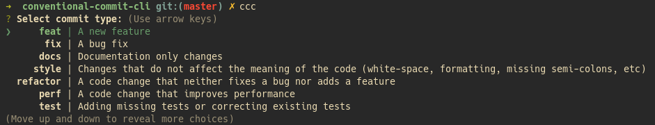

# Conventional Commit CLI

Select commit type, write scope, write message, and commit.

## Introduction

A handy tool to quickly make [Conventional Commits](https://www.conventionalcommits.org).

## Installation

`npm i -g conventional-commit-cli`

## Usage

`ccc`

## What about body and footer?

Complete the commit and use `git commit --amend`.

## License

MIT
